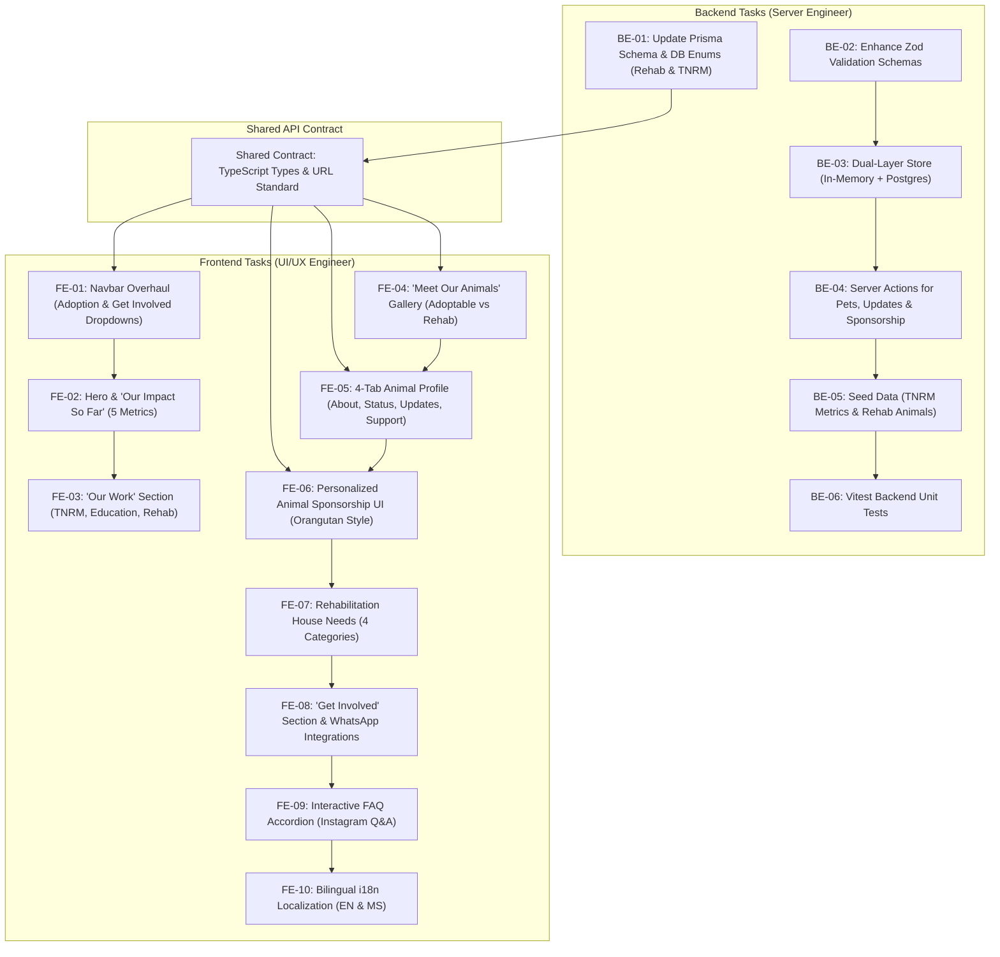

# Sprint Plan & Task Division: Hope For Strays UM Overhaul

> [!NOTE]
> **Sprint Status: Mostly Completed / Superseded by Active Handoffs**  
> Backend tasks `BE-01` through `BE-06` and foundational frontend structures have **shipped** (commits `317c333`, `b268b66`, `3caa738`).  
> - For active status and prioritized open items, refer to **[Handoff: TNRM & Rehabilitation Sprint](HANDOFF_TNRM_REHABILITATION_SPRINT.md)**.  
> - For authentication secret hardening, see **[Target: Secret Hardening](TARGET_SECRET_HARDENING.md)**.  
> - For nested updates and medical timeline persistence, see **[Handoff: Pet History Persistence](HANDOFF_PET_HISTORY_PERSISTENCE.md)**.  
> - For the multi-agent testing suite, see **[Testing Strategy & Multi-Agent Plan](TESTING_STRATEGY_AND_MULTI_AGENT_PLAN.md)**.

This document defines the original development roadmap and task assignments for **Hope For Strays UM** (*Coexistence through TNRM & Education*). Tasks are segmented between the **Backend Server Engineer** and the **Frontend UI Engineer**, along with shared contract definitions.

---

## 👥 Team Roles & Responsibilities

| Role | Engineer | Core Domain |
| :--- | :--- | :--- |
| **Backend Server Engineer** | **You** | Database Schemas (Prisma/Neon), Server Actions, In-Memory Store, Validation (Zod), Seed Scripts, LHDN e-Receipt Engine, Vitest Unit Tests. |
| **Frontend UI Engineer** | **Your Partner** | UI Components (Next.js 16/React 19), Design System & Tailwind CSS, Dropdown Menus, Pet Gallery Filters, 4-Tab Animal Profile, Personal Sponsorship Widget, Wishlist, i18n Localization. |

---

## 📋 Task Matrix Overview

---

## 🛠️ Section 1: Backend Server Engineer Tasks (Your Playbook)

### Task `BE-01`: Update Prisma Schema & Database Models
- **Objective**: Extend database to support `In Rehabilitation` status, clinical updates, TNRM metrics, and pet sponsorship allocations.
- **Target File**: [`prisma/schema.prisma`](file:///c:/Users/User/pet-shelter/prisma/schema.prisma)
- **Key Deliverables**:
  1. Add `status` enum/string values: `'Available' | 'Pending' | 'Adopted' | 'In Rehabilitation'`.
  2. Add fields to `Pet` model:
     - `rehabStage` (String?) e.g., "Surgical Recovery", "Skin Therapy", "Socialization"
     - `rehabStageMs` (String?)
     - `rehabProgressPercent` (Int @default(0))
  3. Create `PetUpdate` model:
     - `id` (cuid), `petId` (relation to Pet), `date` (DateTime), `title` (String), `titleMs` (String?), `content` (Text), `contentMs` (Text?), `image` (String?), `category` (String).
  4. Create `RehabNeedItem` model for shelter wishlist:
     - `id` (cuid), `category` (enum: `URGENT`, `REGULAR`, `LONG_TERM`, `TNRM_EQUIPMENT`), `name` (String), `nameMs` (String?), `quantityNeeded` (String), `urgencyLevel` (String).
  5. Run `npx prisma generate` and `npx prisma db push`.

---

### Task `BE-02`: Enhance Zod Validation Schemas
- **Objective**: Ensure all incoming server action inputs are strictly validated.
- **Target File**: `src/lib/validations/pet.ts` & `src/lib/validations/sponsorship.ts`
- **Key Deliverables**:
  1. `petFilterSchema`: Support `status: z.enum(['all', 'Available', 'In Rehabilitation', 'Pending', 'Adopted'])`.
  2. `sponsorshipPledgeSchema`: Validate `targetPetId: z.string().optional()`, `targetPetName: z.string().optional()`, `frequency: z.enum(['one_time', 'monthly'])`, `tierId: z.string()`, `amountMYR: z.number().min(5)`.
  3. `petUpdateSchema`: Validate clinical and rehab progress updates with sanitized HTML/markdown.

---

### Task `BE-03`: Update Server Store (Dual-Layer Resilience)
- **Objective**: Maintain in-memory and PostgreSQL dual-layer persistence for ultra-fast local development and instant server actions.
- **Target File**: [`src/lib/serverStore.ts`](file:///c:/Users/User/pet-shelter/src/lib/serverStore.ts)
- **Key Deliverables**:
  1. Implement `getPublicPets(filter?: PetFilterState)`:
     - When `filter.status === 'In Rehabilitation'`, return only animals under medical/behavioral rehabilitation.
     - When `filter.status === 'Available'`, return only animals cleared for adoption.
     - Default returns all active non-archived animals.
  2. Implement `getPetById(id: string)`: Return pet with populated `medicalTimeline` and `updates`.
  3. Implement `addPetUpdate(petId: string, update: PetUpdate)`: Append update to memory store and push to Prisma.
  4. Implement `getRehabNeeds()`: Retrieve categorized shelter wishlist items.

---

### Task `BE-04`: React Server Actions Integration
- **Objective**: Expose typed server actions for frontend execution.
- **Target File**: `src/actions/pets.ts`, `src/actions/donations.ts`, `src/actions/needs.ts`
- **Key Deliverables**:
  1. `getPublicPetsAction(filters)`: Server action for dynamic client filtering.
  2. `submitDonationPledgeAction(payload)`:
     - Generate LHDN compliant receipt number (format: `HFS-DON-YYYYMM-XXXX`).
     - Calculate tax-deductible status under LHDN Sec 44(6).
     - Store donor record and emit WhatsApp/Email notification payload.
  3. `getRehabNeedsAction()`: Retrieve wishlist grouped into 4 categories.

---

### Task `BE-05`: Seed Data Population (TNRM Metrics & Animals)
- **Objective**: Populate rich, realistic data for demo and production.
- **Target File**: [`src/data/pets.json`](file:///c:/Users/User/pet-shelter/src/data/pets.json) & [`prisma/seed.ts`](file:///c:/Users/User/pet-shelter/prisma/seed.ts)
- **Key Deliverables**:
  1. Add realistic animals in **In Rehabilitation**:
     - **Kopi** (6-month-old puppy recovering from hind leg fracture, Section 17 UM campus rescue).
     - **Milo** (2-year-old Malaysian mix dog undergoing mange and skin treatment).
     - **Luna** (1-year-old cat post-enucleation surgery, learning indoor navigation).
     - **Oyen** (3-year-old campus cat undergoing socialization and trauma therapy).
  2. Add chronological `updates` array to each pet with dates, clinical progress notes, and photo URLs.
  3. Add TNRM impact stats: 520+ neutered, 380+ rehabilitated, 290+ adopted, 150+ volunteers, 25+ collaborations.

---

### Task `BE-06`: Vitest Backend Unit Test Suite
- **Objective**: Guarantee zero regressions and 100% test pass rate.
- **Target File**: `tests/unit/rehabPets.test.ts` & `tests/unit/sponsorshipPledge.test.ts`
- **Key Deliverables**:
  1. Test status filtering: `getPublicPets({ status: 'In Rehabilitation' })`.
  2. Test personalized sponsorship pledge recording with dedicated `targetPetName` and `targetPetId`.
  3. Run `npm test` and verify all tests pass.

---

## 🎨 Section 2: Frontend UI/UX Engineer Tasks (Your Partner's Playbook)

### Task `FE-01`: Navigation Overhaul & Dropdown Menus
- **Objective**: Reorganize top navbar and mobile sheet into clean, intuitive dropdown menus.
- **Target File**: [`src/components/layout/Navbar.tsx`](file:///c:/Users/User/pet-shelter/src/components/layout/Navbar.tsx)
- **Key Deliverables**:
  1. Brand Logo & Title: **Hope For Strays UM** with subtext *"Coexistence through TNRM & Education"*.
  2. **Adoption** Dropdown:
     - Link 1: *Adoption Process* (`/#how-it-works`)
     - Link 2: *Track Application* (`/applications/track`)
  3. **Get Involved** Dropdown:
     - Link 1: *Volunteer* (`/#get-involved` or `/get-involved#volunteer`)
     - Link 2: *Foster* (`/#get-involved` or `/get-involved#foster`)
     - Link 3: *Corporate CSR & Collaboration* (`/#get-involved` or `/get-involved#corporate`)
     - Link 4: *Partnerships* (`/#get-involved` or `/get-involved#partnerships`)
  4. Top-level links: **Meet Our Animals** (`/pets`), **Our Work** (`/#our-work`), **Rehab Needs** (`/#rehab-needs`), **Donate & Sponsor** (`/donate`).
  5. Mobile drawer: Accordion collapsible sections for Adoption and Get Involved.

---

### Task `FE-02`: Hero Section & "Our Impact So Far" Counters
- **Objective**: Make the core mission front and center with impactful statistics.
- **Target File**: [`src/components/layout/Hero.tsx`](file:///c:/Users/User/pet-shelter/src/components/layout/Hero.tsx)
- **Key Deliverables**:
  1. Title: **Hope For Strays UM**
  2. Tagline: **Coexistence through TNRM & Education**
  3. Narrative: University of Malaya & Selangor humane stray animal management, campus coexistence, and life-saving rescue work.
  4. **"Our Impact So Far" Showcase**:
     - 🐾 **520+** Animals Neutered through TNRM
     - 🩺 **380+** Animals Rehabilitated
     - 🏡 **290+** Animals Adopted
     - 👥 **150+** Volunteers Involved
     - 🤝 **25+** Corporate/Community Collaborations
  5. Action buttons: *Meet Our Animals*, *Pet Match Quiz*, *Sponsor Care*.

---

### Task `FE-03`: "Our Work" Pillar Section
- **Objective**: Educate visitors on the 3 foundational pillars of Hope For Strays UM.
- **Target File**: [`src/components/layout/HomeSections.tsx`](file:///c:/Users/User/pet-shelter/src/components/layout/HomeSections.tsx)
- **Key Deliverables**:
  1. Create `HomeOurWorkSection` component (anchor `id="our-work"`).
  2. Pillar 1 — **TNRM (Trap-Neuter-Return-Manage)**:
     - Humane population stabilization, ear-notching, campus feeder stations, vacuum effect prevention.
  3. Pillar 2 — **Education**:
     - Campus workshops, bite prevention, responsible pet care, myth-busting stray misconceptions.
  4. Pillar 3 — **Rehabilitation**:
     - Medical treatment, trauma recovery, post-surgery foster, behavioral socialization.

---

### Task `FE-04`: 'Meet Our Animals' Gallery & Subcategory Filters
- **Objective**: Transform pet catalog to support *Adoptable* vs *In Rehabilitation* subcategories.
- **Target File**: [`src/components/features/pets/PetGallery.tsx`](file:///c:/Users/User/pet-shelter/src/components/features/pets/PetGallery.tsx) & [`src/app/pets/page.tsx`](file:///c:/Users/User/pet-shelter/src/app/pets/page.tsx)
- **Key Deliverables**:
  1. Page Heading: **"Meet Our Animals"** (Subtitle: *Animals rescued, treated, and cared for by Hope For Strays UM*).
  2. Subcategory Filter Pills:
     - **All Animals**
     - **Adoptable** (Cleared for rehoming)
     - **In Rehabilitation** (Under medical or behavioral care)
  3. Pet Card Badges:
     - Emerald badge for *Adoptable*
     - Amber/Indigo badge for *In Rehabilitation* (displaying `rehabStage` e.g., "Stage 2: Bone Healing")
  4. Card Action Buttons: *View Profile* & *Sponsor Me*.

---

### Task `FE-05`: 4-Part Tabbed Animal Profile View
- **Objective**: Create deep, engaging individual animal profiles.
- **Target File**: [`src/components/features/pets/PetDetailView.tsx`](file:///c:/Users/User/pet-shelter/src/components/features/pets/PetDetailView.tsx)
- **Key Deliverables**:
  1. **Tab 1: About Me**: Personality, rescue background story, breed, age, weight, compatibility badges (dogs, cats, kids, energy).
  2. **Tab 2: My Status**: Prominent status indicator (*Adoptable* or *In Rehabilitation*), veterinary clearance checklist (vaccination, microchip, spay/neuter), medical care timeline.
  3. **Tab 3: My Updates**: Chronological feed of recent photo updates, rehabilitation progress notes, weight checks, and caregiver notes.
  4. **Tab 4: Support Me**: Action center featuring:
     - **"Sponsor [Name]"** button (navigates to `/donate?pet=[Name]` with pre-selected perks preview).
     - **"Apply to Adopt"** button (enabled if adoptable, or foster-to-adopt inquiry if in rehab).

---

### Task `FE-06`: Personalized Animal Sponsorship (Orangutan Project Style)
- **Objective**: Allow donors to select a specific animal to sponsor and see personalized perks.
- **Target File**: [`src/components/features/donations/DonationWidget.tsx`](file:///c:/Users/User/pet-shelter/src/components/features/donations/DonationWidget.tsx) & [`src/components/features/pets/SponsorshipModal.tsx`](file:///c:/Users/User/pet-shelter/src/components/features/pets/SponsorshipModal.tsx)
- **Key Deliverables**:
  1. **Interactive Pet Chooser Carousel**: Visual selector with avatar, name, species, and status.
  2. **RM30 "Rescue Companion & Updates" Tier Highlight**:
     - *Perk 1*: Monthly photo & video progress update via WhatsApp/Email.
     - *Perk 2*: Invitation to arrange occasional visits to spend time with the sponsored animal (subject to sanctuary guidelines & availability).
     - *Perk 3*: Personalized Digital Certificate of Sponsorship.
  3. URL Query Parameter Support: Reading `?pet=Kopi` or `?sponsorPetId=pet-002` to automatically pre-select the pet on page load.
  4. Instant Printable LHDN Tax e-Receipt generation after pledge.

---

### Task `FE-07`: Current Rehabilitation House Needs (Wishlist)
- **Objective**: Display the 4 categories of supplies currently needed at the Rehabilitation House.
- **Target File**: `src/components/features/needs/RehabNeedsSection.tsx` & [`src/app/needs/page.tsx`](file:///c:/Users/User/pet-shelter/src/app/needs/page.tsx)
- **Key Deliverables**:
  1. **Category 1: Urgent Needs** (Recovery wet food, F10 disinfectant, sterile dressings, IV fluids).
  2. **Category 2: Regular Needs** (Puppy/kitten kibble, pee pads, fleece blankets, stainless steel bowls).
  3. **Category 3: Long-term Improvements** (Modular stainless steel kennels, quarantine canopy, industrial washer).
  4. **Category 4: TNRM Equipment** (Humane drop traps, transfer cages, bite-proof gloves, trap tarps).
  5. Interactive "Copy Wishlist Spec" button & Drop-off physical instructions (SS2 PJ sanctuary / UM campus desk).

---

### Task `FE-08`: "Get Involved" Multi-Path Section
- **Objective**: Provide actionable pathways for volunteer, foster, CSR, and partnerships.
- **Target File**: `src/components/layout/HomeSections.tsx` & [`src/app/get-involved/page.tsx`](file:///c:/Users/User/pet-shelter/src/app/get-involved/page.tsx)
- **Key Deliverables**:
  1. 4 Structured Pathways:
     - **Volunteer** (Weekend walking, campus feeding, TNRM field shifts).
     - **Foster** (Post-op recovery foster, neonatal nursery).
     - **Corporate CSR & Collaboration** (Team building workdays, corporate matching).
     - **Partnerships** (Vet clinics, student societies, local councils).
  2. Direct pre-filled WhatsApp action buttons for each specific coordinator.

---

### Task `FE-09`: Comprehensive Interactive FAQ Section
- **Objective**: Answer commonly asked questions from the Instagram community and TNRM operations.
- **Target File**: [`src/components/layout/PetsFaqSection.tsx`](file:///c:/Users/User/pet-shelter/src/components/layout/PetsFaqSection.tsx)
- **Key Deliverables**:
  1. Interactive category tabs: **All**, **TNRM & Coexistence**, **Adoption & Fostering**, **Sponsorship & Donations**, **Volunteering & CSR**.
  2. Real-world Q&As:
     - Why TNRM instead of relocation? (Vacuum effect explanation).
     - What is ear-notching and why is it done?
     - How to report a stray in distress on UM campus?
     - Can I sponsor an animal currently in rehabilitation?
     - Can I visit the Rehabilitation House? (Visiting guidelines).
     - How to claim LHDN Sec 44(6) tax deductions?

---

### Task `FE-10`: Bilingual i18n Localization
- **Objective**: Provide complete English and Bahasa Malaysia translations.
- **Target File**: [`src/lib/i18n/translations.ts`](file:///c:/Users/User/pet-shelter/src/lib/i18n/translations.ts)
- **Key Deliverables**:
  1. Add dictionary keys for all new sections, dropdowns, animal profile tabs, sponsorship perks, and FAQs in both `en` and `ms`.
