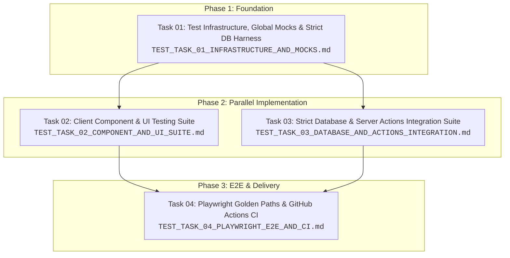

# Testing Architecture Strategy & Multi-Agent Execution Plan

**Date**: 2026-08-26  
**Status**: Ready for Multi-Agent Dispatch  
**Baseline**: 26 unit test files / 223 tests green · `npx tsc --noEmit` clean outside `scratch/`  
**Companion Documents**:
- [System Architecture Blueprint](../architecture/ARCHITECTURE_BLUEPRINT.md)
- [Application Layer Map](../architecture/LAYERS.md)
- [Database & ORM Architecture Guide](../architecture/GUIDE_PRISMA_AND_NEON_ARCHITECTURE.md)

---

## 🎯 1. Executive Summary & Objective

Build an **ultra-reliable, non-brittle, 5-tier testing pyramid** for the Hope for Strays platform (Next.js 16.3.1, React 19.2.8, Prisma 7.9.1, PostgreSQL, Tailwind CSS v4, `@base-ui/react`, Resend).

### The Four Flaws in the Legacy Testing Setup
1. **The In-Memory Fallback False Security Trap**: `src/lib/serverStore.ts` swallows Prisma exceptions and falls back to in-memory JSON data, allowing database schema and query regressions to pass CI unnoticed.
2. **The Server Component / jsdom Trap**: Server Components and Server Actions cannot be cleanly rendered in `jsdom` without creating fragile mock pyramids.
3. **Zero Component / UI Interaction Testing**: Interactive client forms, multi-step validation, quiz matching, and i18n switching have 0% DOM test coverage.
4. **Zero End-to-End (E2E) & CI Automation**: High-value user journeys (adoption application, status tracking, admin review, bilingual navigation) are not verified in real browsers, and no `.github/workflows/ci.yml` pipeline exists.

---

## 📐 2. The 5-Tier Non-Brittle Testing Hierarchy

```
                                  ▲
                                 / \
               [ Tier 5: E2E ]  /   \    Playwright (5 Golden Paths: Adopt, Donate, Track, Admin)
                               /-----\
           [ Tier 4: UI/DOM ] /       \   Testing Library + jsdom (Client forms, quiz, modals, tables)
                             /---------\
     [ Tier 3: DB & Actions]/           \ Vitest + STRICT_PERSISTENCE (Server Actions, Transactions, RBAC)
                           /-------------\
    [ Tier 2: Domain Logic]               \ Vitest Node (FSM, Zod schemas, crypto, rate limits, i18n parity)
                          /-----------------\
  [ Tier 1: Static Guards]                   \ TypeScript strict + ESLint + AST Layer Boundary Tests
```

### Core Non-Brittle Principles
- **Test User Outcomes & Contracts, Never Implementation Details**: Use accessibility roles (`getByRole('button', { name: /submit/i })`) and semantic text instead of fragile CSS selectors or internal component states.
- **Strict Database Mode for Integration Tests**: Activate `STRICT_PERSISTENCE=true` so that failing queries fail the test suite immediately.
- **Fast Auth Fixtures for E2E**: Pre-generate signed `hope_shelter_session` cookies in Playwright to bypass UI logins for admin tests.
- **Centralized Next.js Mocks**: Standardize `cookies()`, `headers()`, and `revalidatePath()` mocks in a single shared test setup.

---

## 🗺️ 3. Multi-Agent Workstream Decomposition

To enable parallel and autonomous execution by multiple AI coding agents, the work is partitioned into four independent, decoupled tasks:



---

## 📋 4. Task Catalog & Dispatch Index

| Task File | Primary Focus | Key Deliverables |
|---|---|---|
| **[TEST_TASK_01_INFRASTRUCTURE_AND_MOCKS.md](TEST_TASK_01_INFRASTRUCTURE_AND_MOCKS.md)** | Infrastructure & Foundation | `STRICT_PERSISTENCE` across repository trio (`serverStore`, `userStore`, `auditLog`), hermetic cache resets, overload-aware `nextMocks.ts`, Vitest setup |
| **[TEST_TASK_02_COMPONENT_AND_UI_SUITE.md](TEST_TASK_02_COMPONENT_AND_UI_SUITE.md)** | Client UI / DOM Testing | `@testing-library/react` + `jsdom`, `AdoptionModal`, `PetMatchQuiz`, `LanguageProvider`, `AdminPetTable` |
| **[TEST_TASK_03_DATABASE_AND_ACTIONS_INTEGRATION.md](TEST_TASK_03_DATABASE_AND_ACTIONS_INTEGRATION.md)** | Server Actions & Persistence | Strict persistence tests, Pet mutations & soft deletes, atomic application status transitions, RBAC |
| **[TEST_TASK_04_PLAYWRIGHT_E2E_AND_CI.md](TEST_TASK_04_PLAYWRIGHT_E2E_AND_CI.md)** | E2E & GitHub Actions CI | `playwright.config.ts`, Page Object Models, 5 Golden Path E2E specs, `.github/workflows/ci.yml` |

---

## 🚦 5. Definition of Done (DoD) for the Full Suite

1. `npm test` runs fast unit and architectural tests in < 3 seconds.
2. `npm run test:components` runs all client component tests in jsdom in < 5 seconds.
3. `npm run test:integration` runs all Server Action and database persistence tests under `STRICT_PERSISTENCE=true`.
4. `npm run test:e2e` executes all 5 Playwright golden paths against the web server cleanly without retries or flaky timeouts.
5. `npm run lint` and `npx tsc --noEmit` remain 100% clean.
6. The entire suite passes in GitHub Actions CI across all parallel jobs.
