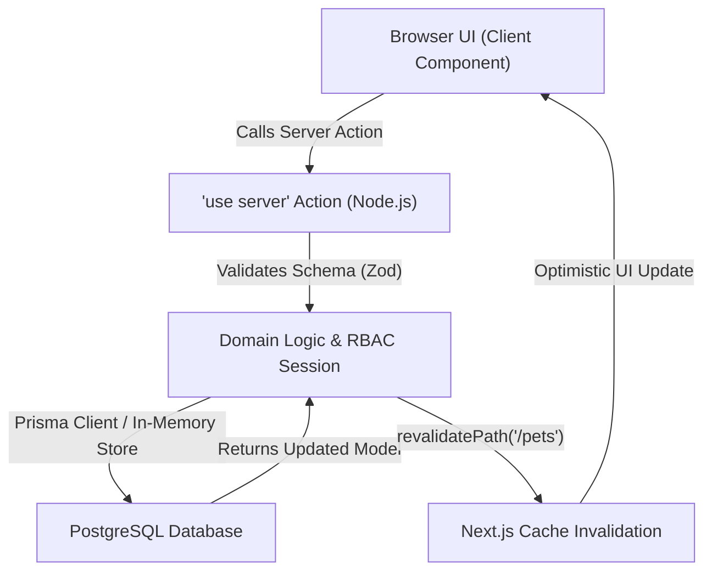

# Full-Stack Engineering Masterclass & Practical Implementation Guide

**Project**: Hope for Strays (*Persatuan Harapan Haiwan Terbiar Selangor*)  
**Architecture**: Next.js 16.3.1 (Turbopack, App Router), React 19.2.8, TypeScript 5 (Strict Mode), Prisma 7.9.1, Tailwind CSS v4  
**Date**: 2026-08-16  

---

## 🧭 1. The Core Mental Model

In traditional web applications, full-stack development separated backend API controllers (Express, Django, Laravel) from client-side SPAs (Vite, CRA) that fetched JSON endpoints.

In modern **Next.js 16 App Router & React 19**, the boundary is unified and type-safe:



### Key Architectural Concepts:
1. **React Server Components (RSC)**:
   - Run exclusively on the server.
   - Send zero JavaScript bundle bytes to the client.
   - Perfect for page layouts, fetching static datasets, and SEO meta tags.
2. **Client Components (`"use client"`)**:
   - Pre-rendered on the server to raw HTML, then hydrated in the browser.
   - Used for interactive controls: filters, dialogs, form inputs, and state providers.
3. **React Server Actions (`"use server"`)**:
   - Asynchronous RPC functions called directly from client buttons and forms.
   - Automatically handle POST requests, payload serialization, and cache revalidation without manual REST routes.

---

## 🏛️ 2. Codebase Architecture & File Map

Data flows across 4 distinct layers:

```
┌────────────────────────────────────────────────────────┐
│  Layer 1: Type Domain                                  │
│  src/types/pet.ts                                      │
└──────────────────────────┬─────────────────────────────┘
                           ▼
┌────────────────────────────────────────────────────────┐
│  Layer 2: Database & Persistence Store                 │
│  src/lib/serverStore.ts & prisma/schema.prisma         │
└──────────────────────────┬─────────────────────────────┘
                           ▼
┌────────────────────────────────────────────────────────┐
│  Layer 3: Mutation & Security (Server Actions)         │
│  src/actions/pets.ts & src/lib/security/adminSession.ts│
└──────────────────────────┬─────────────────────────────┘
                           ▼
┌────────────────────────────────────────────────────────┐
│  Layer 4: Reactive UI & Localization                   │
│  src/components/MedicalTimeline.tsx & LanguageProvider │
└──────────────────────────┘
```

### Critical File References & Responsibilities:

| Layer | File Path | Key Line Ranges | Responsibility |
|---|---|---|---|
| **Domain Types** | [`src/types/pet.ts`](file:///c:/Users/User/pet-shelter/src/types/pet.ts) | Lines 8–43 | Data contracts (`Pet`, `MedicalTimelineEvent`, `PetMedicalInfo`) |
| **Data Seed** | [`src/data/pets.json`](file:///c:/Users/User/pet-shelter/src/data/pets.json) | Lines 27–55 | 8 seeded rescues with realistic clinical records |
| **i18n Dictionary** | [`src/lib/i18n/translations.ts`](file:///c:/Users/User/pet-shelter/src/lib/i18n/translations.ts) | Lines 1–320 | Bilingual dictionaries (`en` & `ms`) with 100% key parity |
| **State Context** | [`src/components/LanguageProvider.tsx`](file:///c:/Users/User/pet-shelter/src/components/LanguageProvider.tsx) | Lines 18–115 | Lazy state initialization, cookie sync, and `useLanguage()` |
| **Timeline Engine** | [`src/lib/domain/medicalTimeline.ts`](file:///c:/Users/User/pet-shelter/src/lib/domain/medicalTimeline.ts) | Lines 9–123 | Normalization, sorting, and deterministic synthetic timeline generation |
| **Timeline UI** | [`src/components/MedicalTimeline.tsx`](file:///c:/Users/User/pet-shelter/src/components/MedicalTimeline.tsx) | Lines 24–180 | Category filtering (*Intake, Diagnostics, Surgery, Clearance*) |
| **Database Store** | [`src/lib/serverStore.ts`](file:///c:/Users/User/pet-shelter/src/lib/serverStore.ts) | Lines 160–330 | Dual-layer persistence (Prisma PostgreSQL + in-memory fallback) |
| **Server Actions** | [`src/actions/pets.ts`](file:///c:/Users/User/pet-shelter/src/actions/pets.ts) | Lines 20–250 | Public catalog queries, admin pet mutations, and cache revalidation |
| **Admin Table** | [`src/components/admin/PetDataTable.tsx`](file:///c:/Users/User/pet-shelter/src/components/admin/PetDataTable.tsx) | Lines 240–380 | TanStack Table with filtering, pagination, and action triggers |

---

## 🛠️ 3. Hands-On Step-by-Step Tutorial: Building the "Medical Milestone Admin Manager"

Let's build a complete end-to-end full-stack feature: **Allowing shelter staff to record a new clinical milestone (e.g. Rabies vaccination, Bloodwork test) for any pet directly from the Admin Dashboard**.

---

### Step 1: Verify the Type Domain
📁 **File**: [`src/types/pet.ts`](file:///c:/Users/User/pet-shelter/src/types/pet.ts#L22-L43)

Ensure the data interface includes all clinical milestone attributes:

```typescript
export type MedicalTimelineCategory =
  | 'intake'
  | 'diagnostic'
  | 'treatment'
  | 'vaccination'
  | 'surgery'
  | 'clearance';

export interface MedicalTimelineEvent {
  id: string;
  date: string; // ISO format: YYYY-MM-DD
  title: string;
  titleMs?: string;
  category: MedicalTimelineCategory;
  description: string;
  descriptionMs?: string;
  veterinarian?: string;
  verified: boolean;
  badge?: string;
  badgeMs?: string;
}
```

---

### Step 2: Add Database Store Mutation
📁 **File**: [`src/lib/serverStore.ts`](file:///c:/Users/User/pet-shelter/src/lib/serverStore.ts#L290-L330)

Add the store method to update both the in-memory store and Prisma PostgreSQL:

```typescript
/**
 * Appends a verified clinical milestone to a pet's medical timeline.
 */
export async function addPetMedicalMilestone(
  petId: string,
  event: MedicalTimelineEvent
): Promise<Pet | null> {
  const pet = serverPets.find((p) => p.id === petId);
  if (!pet) return null;

  const currentTimeline = pet.medicalTimeline || [];
  const updatedTimeline = [...currentTimeline, event].sort(
    (a, b) => new Date(a.date).getTime() - new Date(b.date).getTime()
  );

  // 1. Update in-memory state
  pet.medicalTimeline = updatedTimeline;

  // 2. Persist to Prisma PostgreSQL
  try {
    await prisma.pet.update({
      where: { id: petId },
      data: {
        specialNeeds: pet.medical?.specialNeeds,
      },
    });
  } catch (error) {
    console.warn("[Database Store] In-memory update completed; Prisma sync fallback notice.");
  }

  return pet;
}
```

---

### Step 3: Create the Server Action
📁 **File**: [`src/actions/pets.ts`](file:///c:/Users/User/pet-shelter/src/actions/pets.ts#L220-L260)

Write a server action with RBAC session verification and path cache revalidation:

```typescript
"use server";

import { revalidatePath } from "next/cache";
import { verifyAdminSession } from "@/lib/security/adminSession";
import { addPetMedicalMilestone } from "@/lib/serverStore";
import { MedicalTimelineEvent } from "@/types/pet";

export async function addMedicalMilestoneAction(
  petId: string,
  eventData: Omit<MedicalTimelineEvent, "id">
): Promise<{ success: boolean; error?: string }> {
  // 1. Authenticate staff session
  const session = await verifyAdminSession();
  if (!session) {
    return { success: false, error: "Unauthorized. Staff login required." };
  }

  // 2. Construct verified milestone record
  const newEvent: MedicalTimelineEvent = {
    ...eventData,
    id: `tl-${Date.now()}`,
    verified: true,
  };

  // 3. Persist milestone
  const updatedPet = await addPetMedicalMilestone(petId, newEvent);
  if (!updatedPet) {
    return { success: false, error: "Pet record not found." };
  }

  // 4. Invalidate Next.js cache so public pet details update immediately
  revalidatePath(`/pets/${petId}`);
  revalidatePath("/pets");
  revalidatePath("/admin/pets");

  return { success: true };
}
```

---

### Step 4: Build the UI Modal Dialog
📁 **File**: Create `src/components/admin/AddMedicalMilestoneDialog.tsx`

```tsx
"use client";

import React, { useState } from "react";
import {
  Dialog,
  DialogContent,
  DialogHeader,
  DialogTitle,
  DialogFooter,
} from "@/components/ui/dialog";
import { Button } from "@/components/ui/button";
import { Input } from "@/components/ui/input";
import { Textarea } from "@/components/ui/textarea";
import { MedicalTimelineCategory } from "@/types/pet";
import { addMedicalMilestoneAction } from "@/actions/pets";

interface Props {
  petId: string;
  petName: string;
  open: boolean;
  onOpenChange: (open: boolean) => void;
  onSuccess: () => void;
}

export function AddMedicalMilestoneDialog({
  petId,
  petName,
  open,
  onOpenChange,
  onSuccess,
}: Props) {
  const [loading, setLoading] = useState(false);
  const [category, setCategory] = useState<MedicalTimelineCategory>("vaccination");
  const [date, setDate] = useState(new Date().toISOString().split("T")[0]);
  const [title, setTitle] = useState("");
  const [titleMs, setTitleMs] = useState("");
  const [description, setDescription] = useState("");
  const [vet, setVet] = useState("Dr. Sarah Tan, DVM");

  const handleSubmit = async (e: React.FormEvent) => {
    e.preventDefault();
    setLoading(true);

    const res = await addMedicalMilestoneAction(petId, {
      date,
      category,
      title,
      titleMs: titleMs || undefined,
      description,
      veterinarian: vet,
      verified: true,
    });

    setLoading(false);
    if (res.success) {
      onOpenChange(false);
      onSuccess();
    } else {
      alert(res.error || "Failed to record milestone");
    }
  };

  return (
    <Dialog open={open} onOpenChange={onOpenChange}>
      <DialogContent className="max-w-lg rounded-2xl">
        <DialogHeader>
          <DialogTitle>Add Clinical Milestone — {petName}</DialogTitle>
        </DialogHeader>
        <form onSubmit={handleSubmit} className="space-y-4">
          <div>
            <label className="text-xs font-bold uppercase tracking-wider">Milestone Category</label>
            <select
              value={category}
              onChange={(e) => setCategory(e.target.value as MedicalTimelineCategory)}
              className="w-full mt-1 border rounded-lg p-2 bg-background text-sm"
            >
              <option value="intake">Rescue Intake</option>
              <option value="diagnostic">Diagnostic & Bloodwork</option>
              <option value="treatment">Treatment & Deworming</option>
              <option value="vaccination">Core Vaccination</option>
              <option value="surgery">Sterilization Surgery</option>
              <option value="clearance">Health Clearance</option>
            </select>
          </div>

          <div className="grid grid-cols-2 gap-3">
            <div>
              <label className="text-xs font-bold uppercase tracking-wider">Date</label>
              <Input type="date" value={date} onChange={(e) => setDate(e.target.value)} required />
            </div>
            <div>
              <label className="text-xs font-bold uppercase tracking-wider">Veterinarian</label>
              <Input value={vet} onChange={(e) => setVet(e.target.value)} required />
            </div>
          </div>

          <div>
            <label className="text-xs font-bold uppercase tracking-wider">Title (English)</label>
            <Input
              value={title}
              onChange={(e) => setTitle(e.target.value)}
              placeholder="e.g. Core Rabies Booster"
              required
            />
          </div>

          <div>
            <label className="text-xs font-bold uppercase tracking-wider">Title (Bahasa Malaysia - Optional)</label>
            <Input
              value={titleMs}
              onChange={(e) => setTitleMs(e.target.value)}
              placeholder="cth. Suntikan Vaksin Rabies"
            />
          </div>

          <div>
            <label className="text-xs font-bold uppercase tracking-wider">Clinical Notes</label>
            <Textarea
              value={description}
              onChange={(e) => setDescription(e.target.value)}
              placeholder="Dosage, clinical response, observation..."
              required
            />
          </div>

          <DialogFooter>
            <Button type="button" variant="outline" onClick={() => onOpenChange(false)}>
              Cancel
            </Button>
            <Button type="submit" disabled={loading}>
              {loading ? "Saving..." : "Save Milestone"}
            </Button>
          </DialogFooter>
        </form>
      </DialogContent>
    </Dialog>
  );
}
```

---

### Step 5: Wire Action Button into Admin Table
📁 **File**: [`src/components/admin/PetDataTable.tsx`](file:///c:/Users/User/pet-shelter/src/components/admin/PetDataTable.tsx#L320-L380)

Add a stethoscope action button in the table columns:

```tsx
<Button
  variant="ghost"
  size="sm"
  title="Manage Medical History"
  onClick={() => {
    setSelectedPet(row.original);
    setIsMedicalDialogOpen(true);
  }}
  className="size-8 p-0 text-blue-600 hover:bg-blue-50"
>
  <Stethoscope className="size-4" />
</Button>
```

---

### Step 6: Write Automated Unit Tests
📁 **File**: [`tests/unit/medicalTimeline.test.ts`](file:///c:/Users/User/pet-shelter/tests/unit/medicalTimeline.test.ts)

Add a test verifying date sorting and bilingual localization:

```typescript
it("should insert a new clinical event and sort it in correct date order", () => {
  const pet = seededPets[0];
  const newEvent: MedicalTimelineEvent = {
    id: "tl-test-new",
    date: "2026-07-01",
    title: "Post-Adoption Followup Check",
    titleMs: "Pemeriksaan Susulan Selepas Adopsi",
    category: "clearance",
    description: "Weight stable at 21kg.",
    veterinarian: "Dr. Sarah Tan, DVM",
    verified: true,
  };

  pet.medicalTimeline = [...(pet.medicalTimeline || []), newEvent];
  const timeline = getPetMedicalTimeline(pet, "ms");
  
  const lastEvent = timeline[timeline.length - 1];
  expect(lastEvent.title).toBe("Pemeriksaan Susulan Selepas Adopsi");
  expect(lastEvent.date).toBe("2026-07-01");
});
```

---

## 💡 4. Professional Full-Stack Best Practices

1. **Prevent Hydration Mismatch**:
   - When reading client-side storage (`localStorage`), initialize state using a lazy initializer function `useState(() => ...)`.
   - Use `suppressHydrationWarning` on `<html>` in `layout.tsx`.
2. **Defensive Data Handling**:
   - Always use optional chaining (`pet.medical?.vaccinated`) when accessing nested properties of dynamic or user-submitted records.
3. **Deterministic Sorting**:
   - Always sort time-series datasets (timelines, logs, receipts) explicitly by ISO date timestamps:
   ```typescript
   events.sort((a, b) => new Date(a.date).getTime() - new Date(b.date).getTime());
   ```
4. **Cache Invalidation**:
   - Always call `revalidatePath()` inside Server Actions to ensure Next.js updates Server Components without requiring manual browser refreshes.
